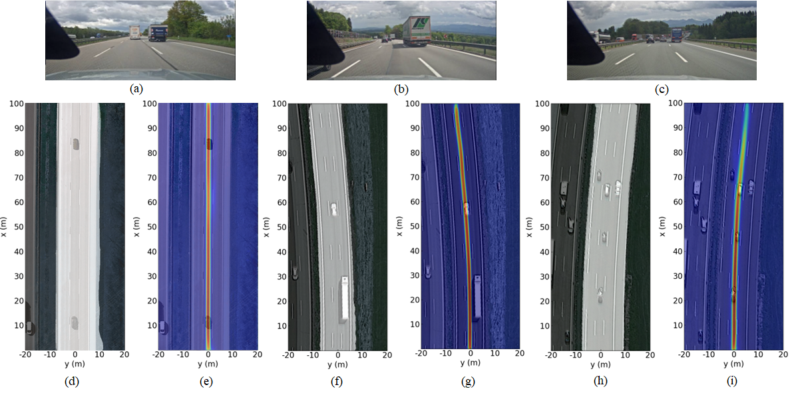

<div align="center">
    <h1>RADxGPS: Cross-Modal Supervision based Road Segmentation and Trajectory Prediction with Automotive Radar</h1>
    <p>
        <a href="FIRST AUTHOR PERSONAL LINK" target="_blank">Zhaoze Wang</a><sup>1</sup>, 
        <a href="SECOND AUTHOR PERSONAL LINK" target="_blank">Yi Jin</a><sup>1</sup>, 
        <a href="THIRD AUTHOR PERSONAL LINK" target="_blank">Anastasios Deligiannis</a><sup>2</sup>, 
        <a href="FOURTH AUTHOR PERSONAL LINK" target="_blank">Juan-Carlos Fuentes-Michel</a><sup>2</sup>, 
        <a href="FIFTH AUTHOR PERSONAL LINK" target="_blank">Martin Vossiek</a><sup>1</sup>
    </p>
    <p>
        <sup>1</sup> Friedrich-Alexander-Universität Erlangen-Nürnberg<br>
        <sup>2</sup> BMW Group<br>IEEE Robotics and Automation Letters - 2024
    </p>
</div>

<div align="center">
    <a href="https://ieeexplore.ieee.org/abstract/document/10628992" target="_blank" class="external-link button is-normal is-rounded is-dark">
        <span class="icon"><i class="fas fa-file-pdf"></i></span>
        <span>Paper</span>
    </a>
</div>

<div align="center">
    <h2>Abstract</h2>
</div>

Automotive radar plays a crucial role in providing reliable environmental perception for autonomous driving, particularly in challenging conditions such as high speeds and bad weather. In this domain, the deep learning-based method is one of the most promising approaches, but the presence of noisy signals and the complexity of data annotation limit its development. In this paper, we propose a novel approach to address road area segmentation and driving trajectory prediction tasks by introducing Differential Global Positioning System (DGPS) data to generate labels in a cross-modal supervised manner. Then our method employs a multi-task learning-based CNN trained by radar point clouds or occupancy grid maps without any manual modification. This multi-task network not only boosts processing efficiency but also enhances the performances in both tasks, compared with single-task counterparts. Experimental results on a real-world dataset demonstrate the effect of our implementation qualitatively, achieving decimeter-level predictions within a 100 m forward range. Our approach attains an impressive 91.4 % mean Intersection over Union (mIoU) in road area segmentation and exhibits an overall average curve deviation of less than 0.35 m within a range of 100 m forward in trajectory prediction.

<div align="center">
    <h2>Method</h2>
</div>

<div align="center">
    
    <p>
        Schematic pipeline of cross-modal supervised multi-task learning structure based on radar as 'Student' and DGPS as 'Teacher'. First, the 2D point cloud cluster from the processed radar signal, or the previous generated OGM, is input into an encoder with shared weights. The associated feature will be fed into different decoders to get the corresponding task-specific output. Labels involve road area and continuous trajectory heat-map, and both are derived from the signals of DGPS, resulting in different losses.
    </p>
</div>

<div align="center">
    <h2>Experimental Results</h2>
</div>

<div align="center">
    
    <p>
        Qualitative visualization of results. (a)-(c) represents the capture of the front camera, and (d)-(i) represents the masked satellite image by road area segmentation and trajectory prediction from the output at the same time-stamp to the above three captures of the front camera. The segmented road area in satellite images (d) (f) (h) is masked with white. In (e) (g) (i) the estimated trajectories heat maps are visualized as masks on corresponding satellite images which red represents higher probabilities of the vehicle's position in the future.
    </p>
</div>

## BibTeX

```bibtex
BibTex Code Here
